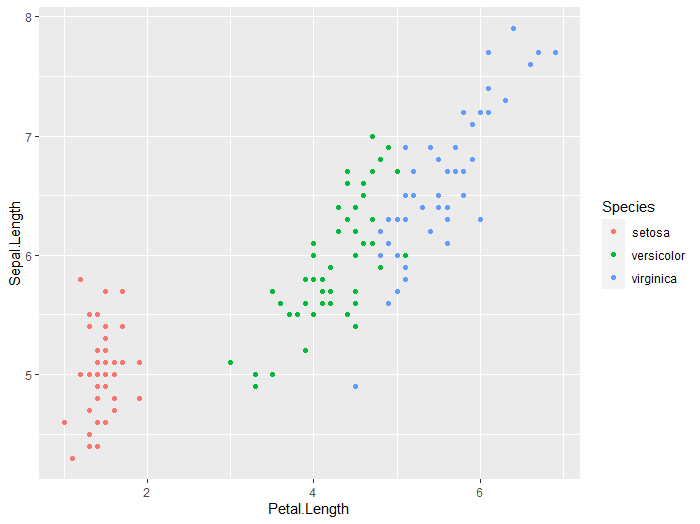
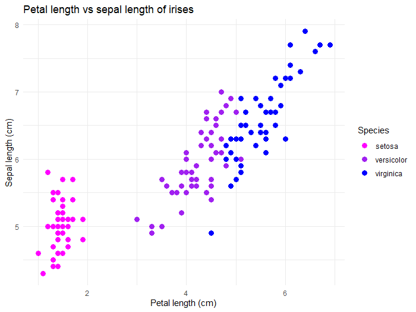

# Introduction to ggplot2

**ggplot2 is based on a *grammar of graphics*:** "a tool that enables us to concisely describe the components of a graphic" [^1]

[^1]: Hadley Wickham. 2010. A Layered Grammar of Graphics. *Journal of Computational and Graphical Statistics* 19(1):3–28

This allows us to build complex graphical representations of our data from consistent, essential building blocks.

Once you understand the *logic* and *grammar* of ggplot, you can create almost any kind of plot you might need.

The basic structure of ggplot code is as follows:

```         
  ggplot(aes(x, y), data) +         #specifying your axes, data
  geom_--- +                #indicating the type of plot, e.g geom_scatter, geom_line, etc. 
  additional geoms +            #layering types of plots 
  thematic arguments            #a number of arguments to modify theme/aesthetics
```

For example,

this code:

Input {: .label .label-green }

``` sh
$ ggplot(aes(x = Petal.Length, y = Sepal.Length), data = iris) +  #axes and data
$ geom_point() +  #plot type (point/scatter)
$  labs(x = 'Petal length (cm)',  #thematic arguments 
$       y = 'Sepal length (cm)', 
$       title = 'Petal length vs sepal length of irises')
```

creates this plot :

Output {: .label .label-yellow }


# Making the plots pretty

In general, the best strategy to make plots is to get the bare bones plot, then add aesthetic parameters one at a time. That way, you know what causes errors if (likely when) they arise.

### Example plot building workflow

``` r
# 1, make the bare bones plot
ggplot(aes(x = Petal.Length, y = Sepal.Length), data = iris) + 
geom_point()
```


``` r
# 2, make more major aestetic changes
  # by major we mean adding completely new parameters, like the color argument added in the aes section
ggplot(aes(x = Petal.Length, y = Sepal.Length, color=Species), data = iris) + 
geom_point() 
```



``` r
# 3, make more minor aestetic changes
  # these modify parts of your plat that already exist 
ggplot(aes(x = Petal.Length, y = Sepal.Length, color=Species), data = iris) + 
geom_point(cex=3) + ## change point size
labs(x = 'Petal length (cm)',   ## add labels
y = 'Sepal length (cm)', 
title = 'Petal length vs sepal length of irises')+
scale_color_manual(values=c("magenta", "purple", "blue"))+ ## change point color
theme_minimal() ## set a pretty background theme
```


